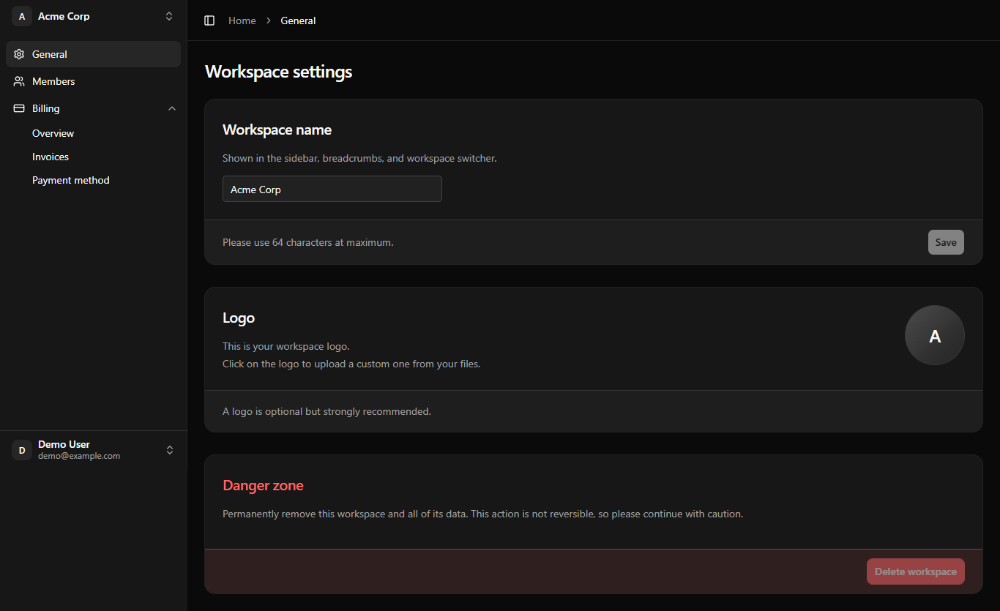
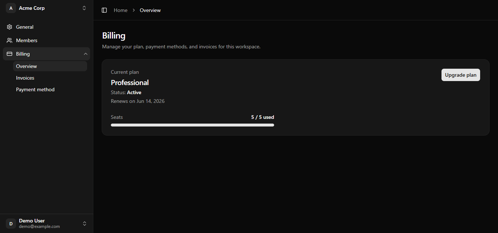
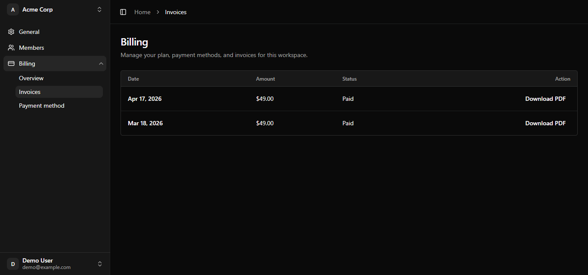
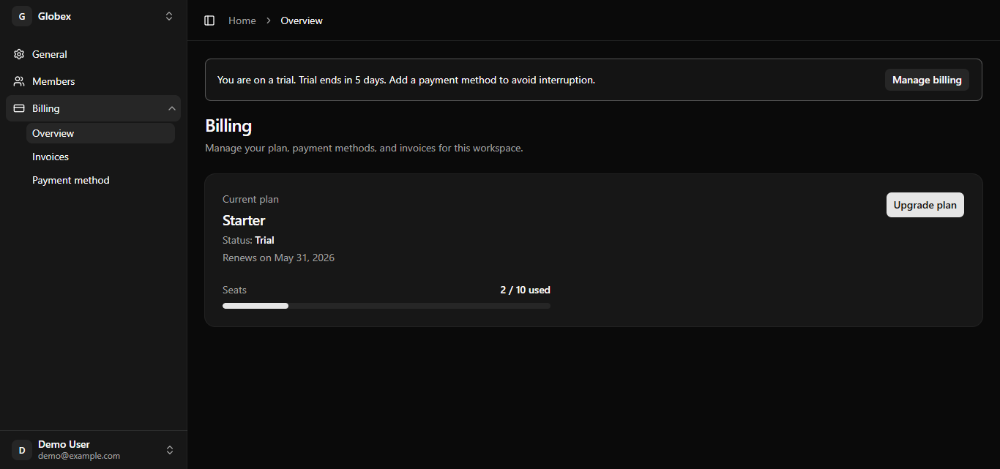
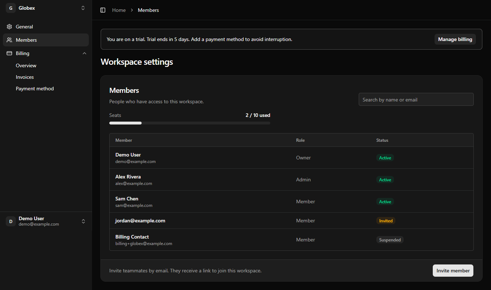

# angular-saas-starter-ui

Angular B2B SaaS shell — layout, org settings, auth UI. **You bring the API.**

Standalone UI monorepo (Spartan + Tailwind v4). Implement `@oequ/ports` against your API. For Supabase, RLS, and tenant isolation at the database layer, see the full-stack starter: [oequ/saas-starter](https://github.com/oequ/saas-starter).

**Current UI release:** `v0.3.0-ui` — workspace billing (mock), seat limits, shell trial banner.

## Stack

- Angular 21 · Nx 22
- [Spartan UI](https://spartan.ng) (`@spartan-ng/brain`, helm in `libs/ui`)
- Tailwind CSS v4

## Quick start

```bash
npm install
npx nx serve demo
```

Open http://localhost:4200

## Live demo (GitHub Pages)

After enabling **Pages → Source: GitHub Actions** in the repo settings:

**https://oequ.github.io/angular-saas-starter-ui/**

Settings: **https://oequ.github.io/angular-saas-starter-ui/settings**

## Preview

### Workspace settings (General)



### Billing (Overview, invoices, trial)

Collapsible **Billing** in the workspace sidebar: Overview · Invoices · Payment method. Mock orgs:

| Workspace | Billing state | Demo purpose |
|-----------|---------------|--------------|
| **Acme Corp** | Active, 5/5 seats | Seat meter + invite blocked on Members |
| **Globex** | Trialing | Shell trial banner + mock upgrade funnel |







### Members — seat limit (Acme)



Regenerate screenshots after UI changes (starts dev server automatically):

```bash
# PowerShell
$env:UPDATE_SCREENSHOTS='1'; npm run screenshots

# bash
UPDATE_SCREENSHOTS=1 npm run screenshots
```

## Monorepo layout

```text
apps/demo              # Runnable demo (mock adapters)
apps/demo-e2e          # Playwright E2E
libs/ports             # AuthPort, OrgPort, BillingPort — interfaces only
libs/shell             # App layout (sidebar, header, billing banner)
libs/features-org      # Workspace settings (general, members, billing)
libs/ui                # Spartan helm components (@spartan-ng/helm/*)
libs/adapters-mock     # Mock port implementations for demo
```

## Scripts

| Command | Description |
|---------|-------------|
| `npx nx serve demo` | Dev server |
| `npx nx build demo` | Production build |
| `npm run e2e` | Playwright E2E (billing + shell smoke) |
| `npm run screenshots` | Regenerate `docs/assets/*.png` (set `UPDATE_SCREENSHOTS=1`) |
| `npx nx run-many -t lint --all` | Lint all projects |
| `npx nx run-many -t test --all` | Unit tests |

## Billing (v0.3)

Architecture and checklist: [BILLING_UI.md](https://github.com/oequ/saas-starter/blob/main/docs/BILLING_UI.md) in `oequ/saas-starter`.

E2E covers:

- **Upgrade funnel** — Globex (trialing) → Upgrade → simulate checkout → active Professional
- **Seat guard** — Acme (5/5) → Members → invite disabled + link to billing
- **Sidebar IA** — Billing sub-nav routes (overview / invoices / payment)

## Product plan

Architecture and integration with the full-stack repo: [ANGULAR_SAAS_STARTER_UI.md](https://github.com/oequ/saas-starter/blob/main/docs/ANGULAR_SAAS_STARTER_UI.md) (in `oequ/saas-starter`).

## License

MIT — see [LICENSE](./LICENSE).
